# auto-login 状态机说明（基于当前代码实现）

> 版本基线：按当前仓库代码（`src/main.py`、`src/scheduler.py`、`src/runner.py`、`src/web_login.py`）整理。  
> 说明重点：这里的“状态机”不是单一 `enum`，而是**多层级状态机协作**。

## 1. 总览：四层状态机

当前系统可拆成 4 层状态机：

1. 入口与模式选择状态机（CLI）
2. 调度状态机（常驻调度、加锁、防并发）
3. 账号执行状态机（账号轮换、重试、断点、停止）
4. 场景状态机（频道/角色/进游戏识别与异常恢复）

---

## 2. 入口与模式选择状态机

核心代码：`src/main.py:62`。

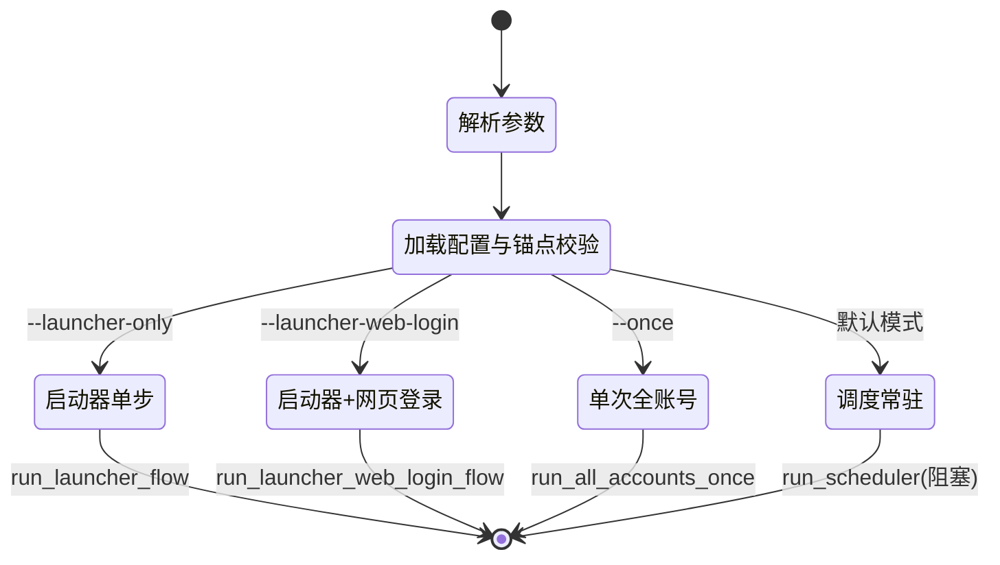

### 关键点

- `main` 在分流前统一完成配置加载和锚点存在性校验（`src/main.py:90`）。
- 默认不传模式参数时进入调度常驻（`src/main.py:70`、`src/main.py:119`）。

---

## 3. 调度状态机（Scheduler）

核心代码：`src/scheduler.py:70`。

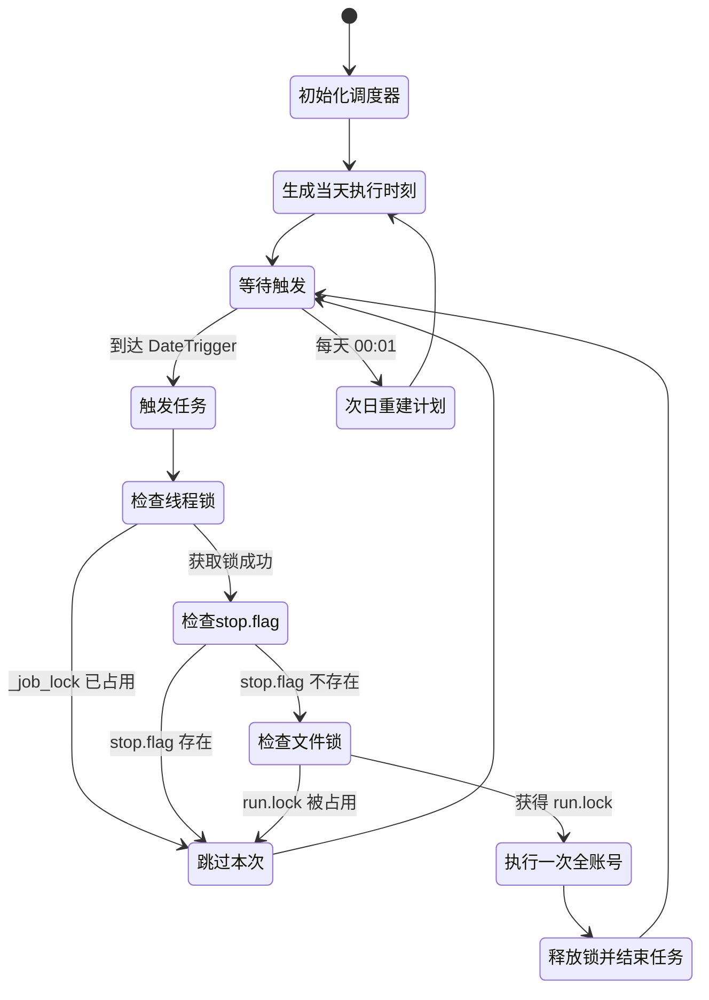

### 关键点

- 双重防并发：
  - 进程内互斥锁 `_job_lock`（`src/scheduler.py:84`）。
  - 文件锁 `logs/run.lock`（`src/scheduler.py:91`）。
- 若计划时间已过，会“立即补跑一次”（`src/scheduler.py:126`）。
- 随机窗口使用日期种子保证“当天稳定可复现”（`src/scheduler.py:170`）。

---

## 4. 账号执行状态机（run_all_accounts_once）

核心代码：`src/runner.py:281`。

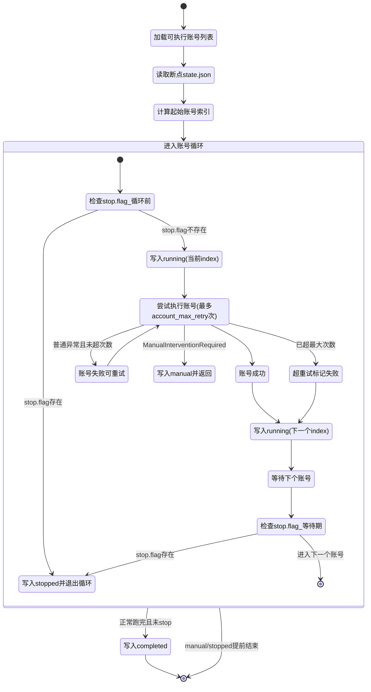

### `state.json` 状态语义

核心写入点：`src/runner.py:445`。

| status | 含义 | 典型写入位置 |
|---|---|---|
| `running` | 流程进行中，同时记录 `next_index` | 每个账号开始与结束后 |
| `stopped` | 检测到 `stop.flag` 后安全停止 | 循环前或账号间等待时 |
| `manual` | 触发人工介入策略，流程中止 | `ManualInterventionRequired` 或 `error_policy=manual` |
| `completed` | 当轮执行完成 | 全部账号结束后 |

### 断点恢复规则

核心代码：`src/runner.py:468`。

- `accounts_hash` 不一致：忽略断点，从头开始。
- `status=completed` 或 `next_index > total`：从头开始。
- 其他情况：从 `next_index` 对应账号恢复。

---

## 5. 单账号主流程状态机

核心入口：`src/runner.py:230`（`run_launcher_web_login_flow`）。

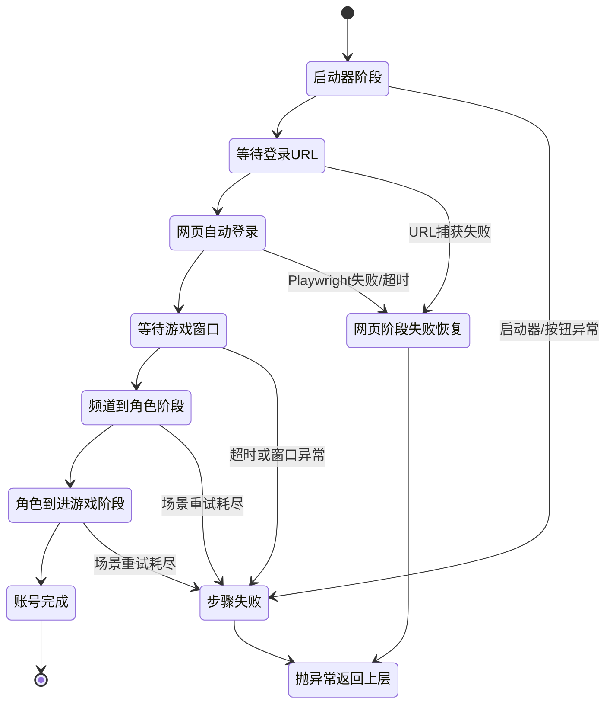

### 网页阶段失败恢复分叉

核心代码：`src/runner.py:194`。

- 固定动作：先保存证据。
- `error_policy=manual`：保留现场并返回异常。
- `error_policy=restart`：关闭浏览器窗口、杀浏览器进程、重置启动器，再抛异常回上层重试。

---

## 6. 场景状态机（频道/角色/进游戏）

场景检查器构建：`src/runner.py:490`。  
基础场景：

- `频道选择界面`
- `角色选择界面`
- `进入游戏界面`

### 6.1 通用等待状态机（模板优先 + 异常补偿）

核心代码：`src/runner.py:928`。

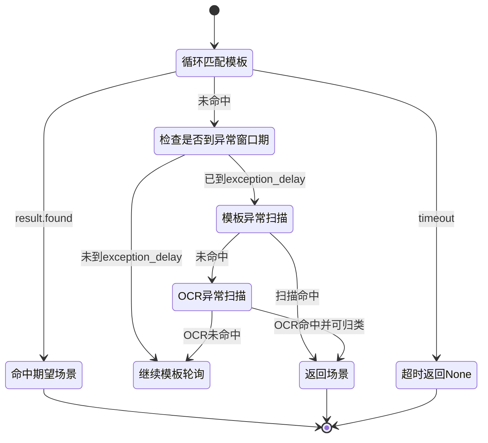

### 6.2 频道 -> 角色 子状态机

核心代码：`src/runner.py:1078`。

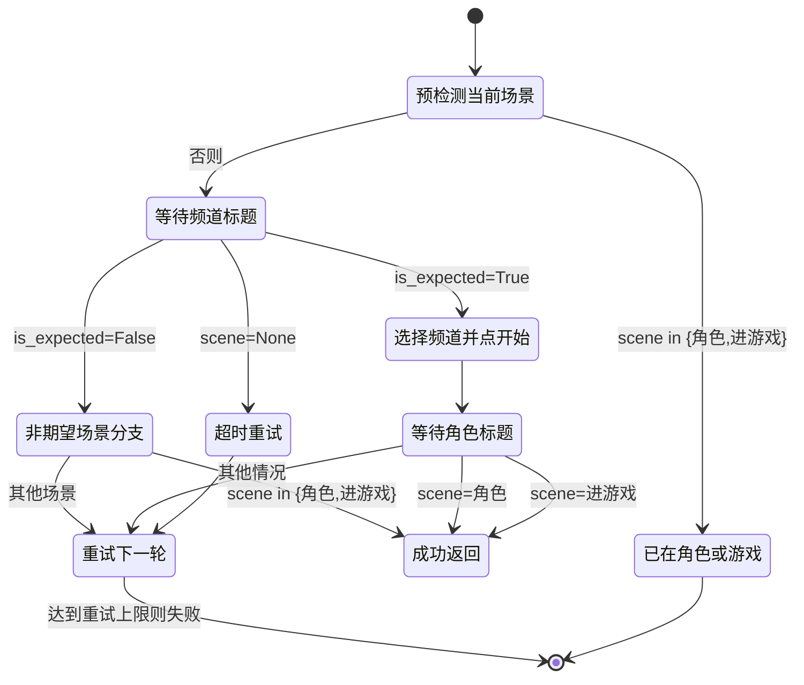

#### 频道选择内部刷新机（`_select_channel_with_refresh`）

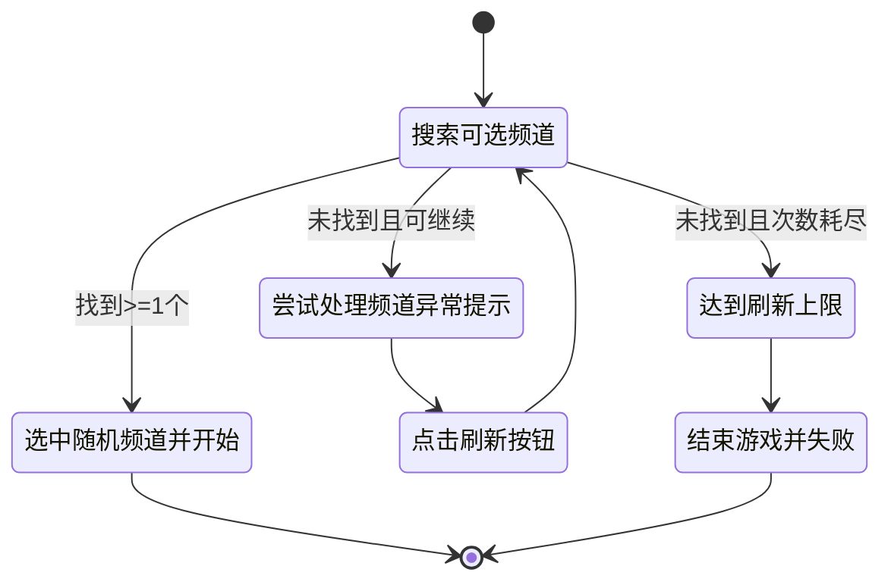

### 6.3 角色 -> 进游戏 子状态机

核心代码：`src/runner.py:1154`。

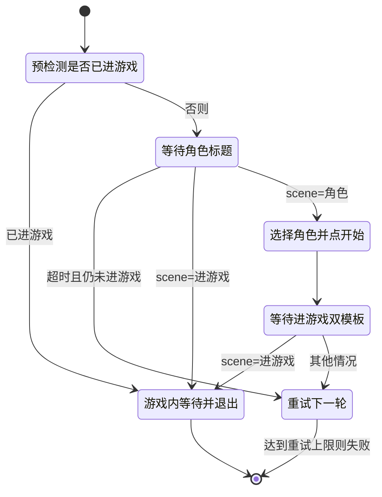

---

## 7. 失败与恢复状态机

### 7.1 通用步骤失败（`_handle_step_failure`）

核心代码：`src/runner.py:1743`。

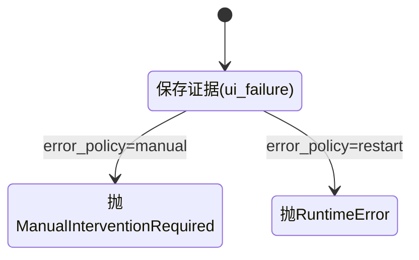

### 7.2 账号循环中的异常恢复（`run_all_accounts_once`）

核心代码：`src/runner.py:342`。

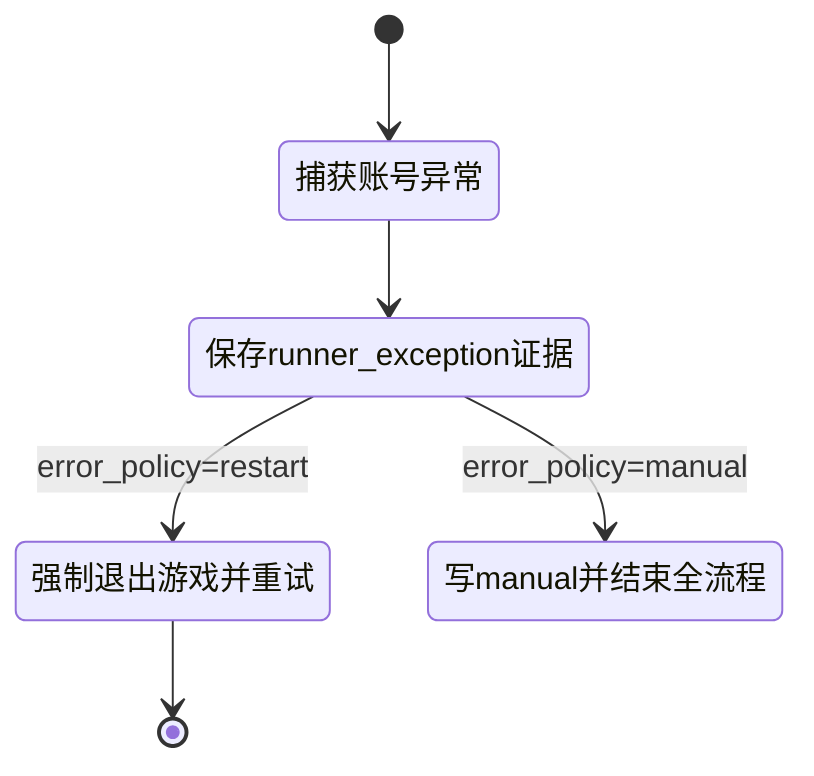

### 7.3 游戏退出策略（`_force_exit_game`）

核心代码：`src/runner.py:1417`。

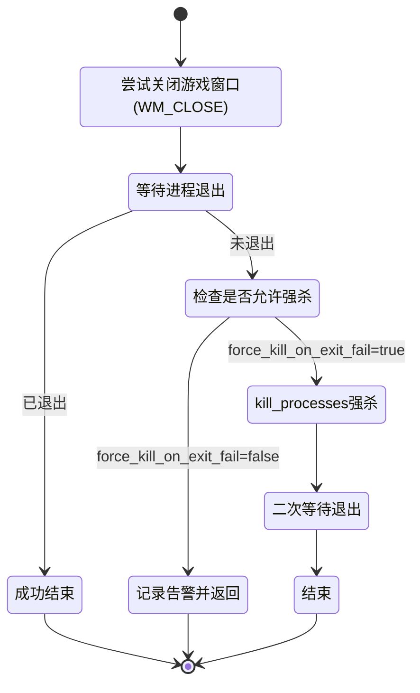

---

## 8. 登录 URL 捕获状态机（网页登录前置）

核心代码：`src/web_login.py:37`。

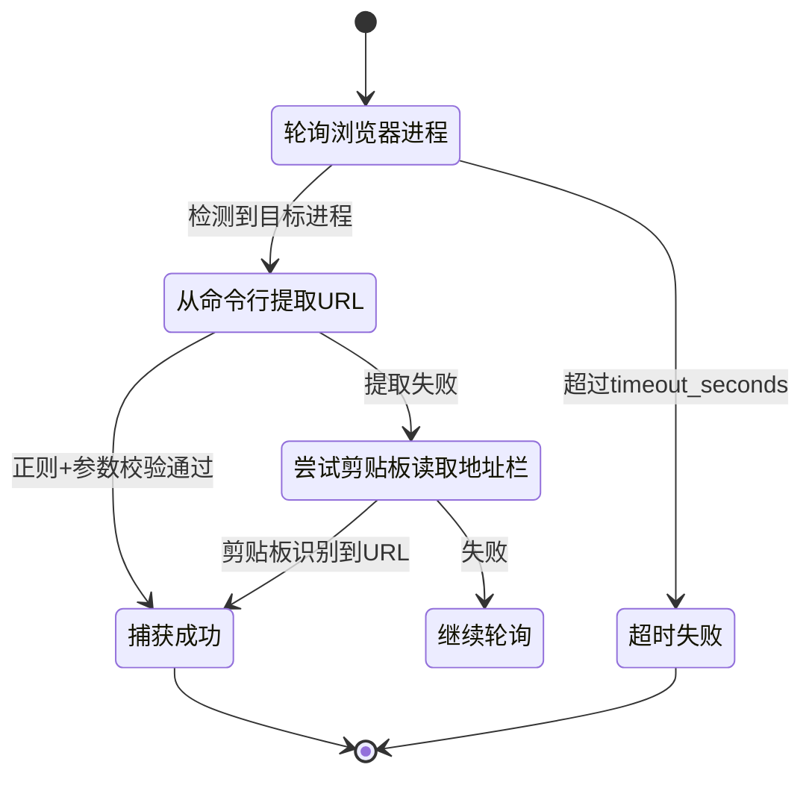

### 特点

- 命令行提取优先，剪贴板读取作为回退。
- 捕获成功后可按配置关闭登录页标签（`Ctrl+W`）。

---

## 9. `stop.flag` 对状态机的影响

`stop.flag` 是跨层“中断信号”：

- 调度层：任务触发前检查，存在则该次不启动（`src/scheduler.py:87`）。
- 账号层：
  - 进入账号前检查（`src/runner.py:307`）。
  - 账号间等待前再检查（`src/runner.py:402`）。
- 语义：**优雅停止**，不强行中断当前函数栈，而是在安全边界退出。

---

## 10. 你可以如何读这个状态机

建议按下面顺序对照源码阅读：

1. `src/main.py:62`（入口分流）
2. `src/scheduler.py:70`（调度触发与锁）
3. `src/runner.py:281`（账号循环主状态机）
4. `src/runner.py:230`（单账号主流程）
5. `src/runner.py:928`（模板等待+异常补偿）
6. `src/runner.py:1078` 与 `src/runner.py:1154`（场景推进）
7. `src/runner.py:1743`（统一失败出口）

---

## 11. 结论

当前项目状态机设计属于“**分层状态机 + 异常补偿闭环**”：

- 上层控制节奏（调度、轮换、重试、停止）。
- 下层控制场景收敛（模板优先 + OCR兜底 + 刷新重试）。
- 失败路径统一留证，并由 `error_policy` 决定“自动恢复”或“人工介入”。

